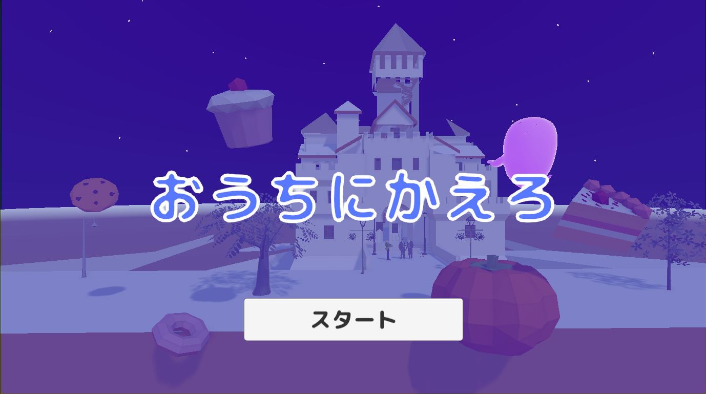

# おうちにかえろ

## ゲームの内容
時間内に迷路のような庭園から抜け出して、朝が来る前におうちに帰る、脱出系タイムアタックゲーム。

(docs/images/スクリーンショット 2026-01-20 014253.png)
(docs/images/スクリーンショット 2026-01-20 014945.png)
(docs/images/スクリーンショット 2026-01-20 014910.png)

## 操作説明
- 矢印上下・ＷＳキーで前後移動、矢印左右・ＡＤキーで左右に回転
- スタート、リトライ、タイトルに戻るボタンのみマウスクリック
